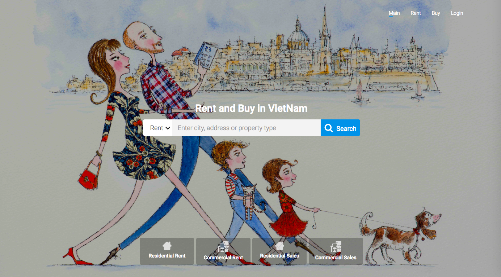

<p align="center">
  <b>How to Build Full-Stack Apps with Serverless and React</b>
</p>

------------------------------------------------------------------------------------

[Serverless-DevOps Stack](http://serverless-devops.s3-website-us-east-1.amazonaws.com/) is an open source guide for building and deploying full-stack apps using Serverless and React on AWS.

We are going to create a [DApp-Boilerplate](https://github.com/o2oprotocol/dapp-boilerplate) from scratch using React.js, AWS Lambda, API Gateway, DynamoDB, and Cognito.



This is a React Boilerplate for Ethereum DApp; also cover how add User Authentication and handle File Uploads.

### Source for the O2O Mall

- [Backend Serverless API](https://github.com/o2oprotocol/o2o-serverless)
- [Frontend React app](https://github.com/o2oprotocol/dapp-boilerplate)

### 2. Installation

Install the dependencies with [Bundler](http://bundler.io/):

~~~bash
$ bundle install
# sudo bundle install
~~~

Run `jekyll` commands through Bundler to ensure you're using the right versions:

~~~bash
$ bundle exec jekyll serve
~~~

> [Production Build](https://serverless-devops.o2oprotocol.io)

  ```
   cd serverless-devops &&
   JEKYLL_ENV=production bundle exec jekyll build &&
   s3_website push --config-dir .
  ```  
